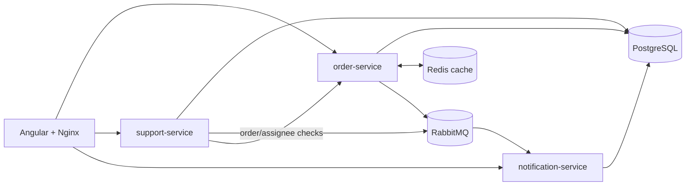
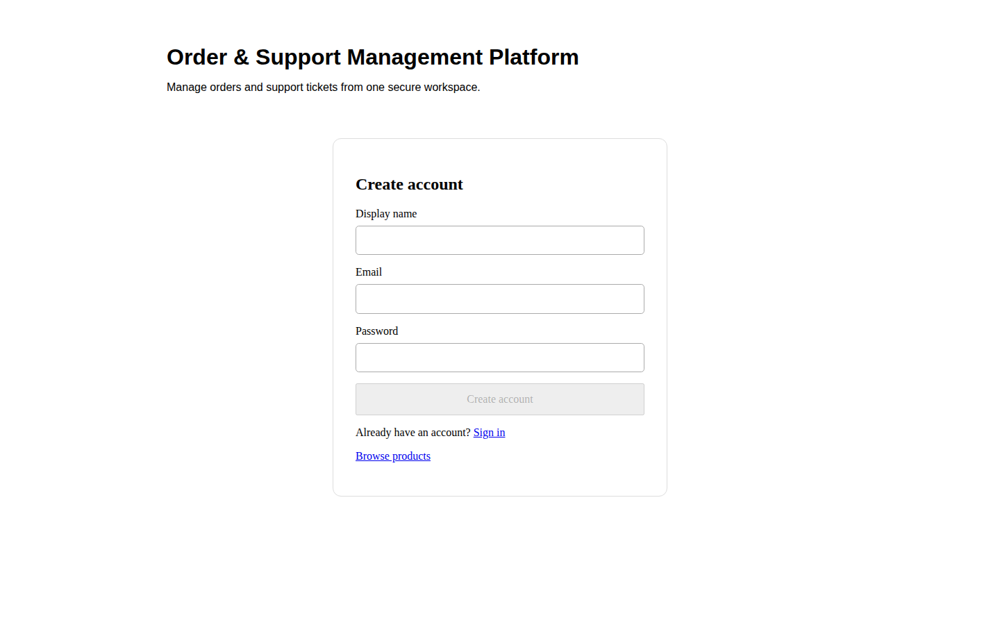
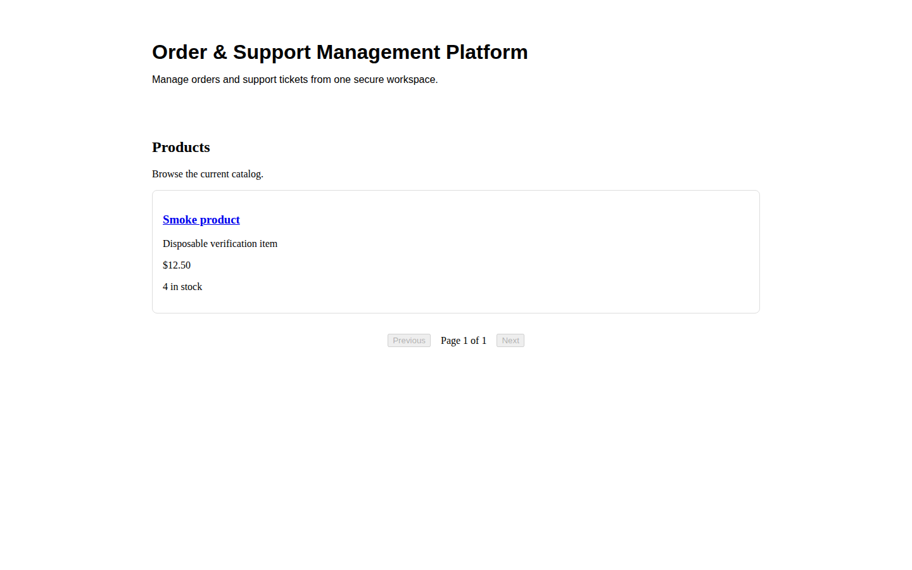

# Order & Support Management Platform

Portfolio project for an order and support platform built with Java 21, Spring Boot, Angular, PostgreSQL, Redis, and RabbitMQ. Customers browse products, place orders, open tickets and read event-driven notifications. Support agents manage tickets; administrators manage products and order status.

## Portfolio tour

- [Architecture and trade-offs](docs/architecture.md) · [ER diagram](docs/er-diagram.md) · [API guide and examples](docs/api-guide.md) · [Duplicate-event RCA](docs/incident-rca.md)
- [Jenkins pipeline and release controls](infra/jenkins/README.md) · [Kubernetes deployment and verification](infra/kubernetes/README.md) · [Legacy ticket migration guide](docs/legacy-ticket-upgrade.md)
- Local UI screenshots below were captured from the running Compose frontend with disposable demo data.



| Registration | Catalog after the disposable smoke order |
| --- | --- |
|  |  |

## Project layout

- `backend/order-service/` — authentication, catalog, and order API (port 8081)
- `backend/support-service/` — support ticket API (port 8082)
- `backend/notification-service/` — notification API and event consumer (port 8083)
- `frontend/` — strict TypeScript Angular application
- `infra/jenkins/` — tested release pipeline and publish helper
- `infra/kubernetes/` — Kustomize workloads, probes, Services, Ingress and verification
- `docs/` — architecture, API, ER and incident evidence

## Local prerequisites

- Docker Compose v2
- OpenSSL for generating a private local JWT key; Python 3 for the smoke test
- Java 21 and Maven 3.9+ (for running APIs outside containers)
- Node.js 22+ and npm (for the Angular dashboard)

## Run the local stack

Create a private `.env` file before starting the stack. The JWT secret is required and must be shared by all three services:

```bash
umask 077
cp .env.example .env
printf 'JWT_SECRET=%s\n' "$(openssl rand -hex 32)" >> .env
```

Customize local database credentials or host ports in `.env` if needed, then build and start the complete stack:

```bash
docker compose up -d --build --wait
```

Open the Angular dashboard at `http://localhost:8080`. Nginx serves it and proxies API calls to the three services. The services expose health at `/actuator/health`. PostgreSQL is available on `localhost:5432`, Redis on `localhost:6379`, and RabbitMQ on `localhost:5672`; the RabbitMQ management console is at `http://localhost:15672`. All host ports can be changed in `.env`.

| API | Local address |
| --- | --- |
| Order | `http://localhost:8081` |
| Support | `http://localhost:8082` |
| Notification | `http://localhost:8083` |

For frontend development outside containers, run `cd frontend && npm ci && npm start`. Development API URLs are in `src/environments/environment.ts`; the container build uses the production API prefixes through Nginx.

To start only data dependencies, use `docker compose up -d postgres redis rabbitmq`.

## End-to-end verification

Run `scripts/verify-e2e.sh` with Docker Compose and Python 3 available. It generates a fresh private JWT secret for the run, builds the four images, starts a separate temporary Compose project with its own database and host ports, seeds one disposable product, then checks the Angular route, registration, login, product listing, order creation, ticket creation, and the resulting customer notification through the frontend proxy. It removes its containers and database volume afterward. Set `KEEP_SMOKE_STACK=1` to retain a run for inspection. To verify other database settings without changing the working tree, set `SMOKE_ENV_FILE` to an absolute path to a custom Compose env file.

The smoke test seeds a product through PostgreSQL because public registration only grants the CUSTOMER role and product creation requires ADMIN. The normal stack starts blank by default. To populate local portfolio data, set `DEMO_DATA_ENABLED=true`, `DEMO_ADMIN_EMAIL`, and a private `DEMO_ADMIN_PASSWORD` in `.env` before starting Compose. It creates an idempotent local-only Admin account and six catalog products. Do not enable this flag outside a disposable development environment.

If startup fails, inspect `docker compose ps` and `docker compose logs <service>`. The API containers use their `/actuator/health` endpoints for health checks; Compose waits for PostgreSQL, Redis, and RabbitMQ before starting dependent services. If a host port is occupied, change the corresponding `*_HOST_PORT` value in `.env`.

## CI/CD

The Jenkins Multibranch Pipeline is in `infra/jenkins/Jenkinsfile`. Agent requirements, credential IDs, parameters, image tags, and the optional Kubernetes deployment contract are documented in `infra/jenkins/README.md`.

The Kubernetes Kustomize manifests, secret setup, local-cluster steps, and rollout verification are documented in `infra/kubernetes/README.md`.

## Verification and interview evidence

The final quality-gate commands and their results are recorded in the [quality-gate evidence](docs/quality-gate.md). From a checkout with the listed prerequisites, run the backend suites through `backend/mvnw`, the Angular tests/build from `frontend/`, `scripts/verify-e2e.sh`, `scripts/verify-kubernetes.sh --offline`, and a Gitleaks history/worktree scan. The Compose smoke creates its own temporary project and verifies registration, login, catalog, order, linked ticket and `OrderCreated` notification. The Kubernetes offline check validates rendered manifests; a live cluster rollout requires the prerequisites in the Kubernetes guide.

| Entry / Junior job requirement | Repository evidence |
| --- | --- |
| Java server logic, REST APIs, OOP/MVC, front-end integration | Three Spring Boot services, Angular routes, controllers/services, [API examples](docs/api-guide.md) and OpenAPI. |
| SQL/data models and NoSQL use | Flyway migrations, [ER diagram](docs/er-diagram.md), PostgreSQL transaction/index tests and Redis cache/fallback tests. Redis is a cache, not a second source of truth. |
| Microservices and integration | Service-owned schemas, support-to-order HTTP validation, RabbitMQ events, outbox replay and idempotent notification consumer. |
| Security and performance | BCrypt, JWT/RBAC and ownership checks, validation, paginated APIs, indexed queries, stock transaction/locking and Redis fallback. |
| Automated tests, Git/build tools and CI/CD | Maven/JUnit/Spring integration tests, Angular tests/build, Docker Compose smoke, Git history and [Jenkins stages](infra/jenkins/README.md). |
| Containers, deployment and troubleshooting | Multi-stage Dockerfiles, Compose health checks, [Kubernetes probes and rollout guide](infra/kubernetes/README.md), [incident RCA](docs/incident-rca.md). |
| Technical communication | This setup guide, architecture and API documentation, ER diagram, trade-offs and upgrade runbook. |

The repository demonstrates an internal HTTP integration and message queue; it does not connect to a real third-party provider. A live Jenkins controller/registry/Kubernetes release and cloud deployment need external infrastructure. Academic credentials, years of employment, teamwork and Agile experience are personal qualifications and cannot be established by repository code.
