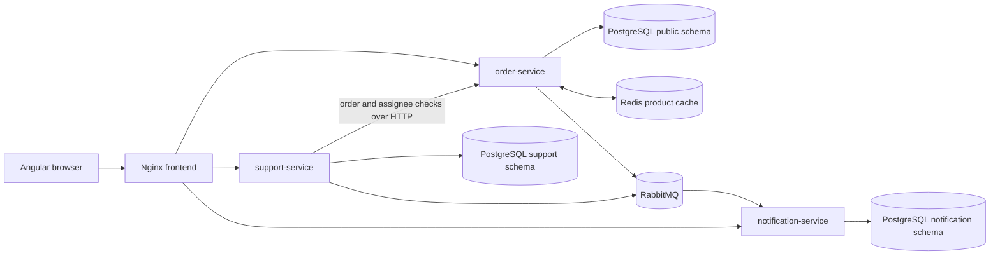

# Architecture and delivery

The platform is a small order and support system. Angular calls three Spring Boot APIs through the Nginx frontend proxy. `order-service` owns identity, catalog, inventory and orders; `support-service` owns tickets and comments; `notification-service` turns broker events into customer notifications. PostgreSQL is shared as a server, with service-owned schemas and no cross-service table reads.

## Request and event path

1. A customer signs in through `order-service`. BCrypt stores password hashes; the three APIs verify the same environment-supplied JWT key. Controller and service checks enforce role and ownership even if a browser route is bypassed.
2. Catalog reads try Redis and fall back to PostgreSQL if Redis is unavailable. Writes invalidate cached pages and details after commit.
3. Order creation locks products, reserves stock, prices the items, saves the order and an `OrderCreated` outbox row in one SQL transaction. A failed reservation rolls back the order and stock changes. Cancellation restores stock once.
4. The outbox dispatcher sends versioned events to RabbitMQ after commit and replays pending rows after a broker interruption. Ticket status changes use a separate support-service outbox. `support-service` validates order ownership and assignees through `order-service` APIs.
5. `notification-service` consumes order and ticket events. Its unique `event_id` constraint and duplicate handling make redelivery idempotent. Malformed messages and exhausted retries go to a dead-letter queue. Customers can read only their own notifications.

`X-Correlation-ID` is returned in HTTP responses and carried in published events. The notification listener includes it in failure logs, which helps trace a rejected event to its initiating request. The APIs do not yet provide a complete correlation-aware HTTP access log across all services. See [the duplicate-event incident](incident-rca.md) for a concrete failure analysis.

## Security and operations

Public registration creates `CUSTOMER` accounts. `SUPPORT` and `ADMIN` identities are provisioned by a trusted operator; the public API cannot elevate a role. Product writes and order status updates require `ADMIN`; ticket assignment/status changes require `SUPPORT` or `ADMIN`. A missing/invalid JWT returns `401`; an authenticated user without access receives `403`. Lists are paginated and application errors share a JSON shape. Signing keys and service passwords are supplied through local environment variables or Kubernetes Secrets, never image layers.

Compose provides local PostgreSQL, Redis, RabbitMQ, the APIs and frontend with health-gated startup. The frontend proxies same-origin `/api/orders/`, `/api/support/` and `/api/notifications/` paths. Jenkins scans for secrets, runs backend and Angular tests, builds SHA-tagged images, runs the full Compose smoke against those exact images, and optionally pushes them to a trusted immutable registry. Kubernetes uses probes, resource requests/limits, internal Services, ingress policies and an Ingress to the frontend. See the [Jenkins](../infra/jenkins/README.md) and [Kubernetes](../infra/kubernetes/README.md) runbooks.

## Deliberate trade-offs

| Choice | Benefit | Limit |
| --- | --- | --- |
| One PostgreSQL server, separate schemas | Simple local setup while preserving table ownership | Server failure affects all three services; production needs backups and a managed HA database. |
| JWT verified independently by each API | No per-request identity network hop | Key rotation must be coordinated across services. |
| SQL outbox plus at-least-once broker delivery | A committed business change retains its event if RabbitMQ is down | Consumers must deduplicate; event delivery is not instantaneous. |
| Redis as an optional cache | Product reads survive Redis outages | Database load rises while the cache is unavailable. |
| One-replica local Kubernetes dependencies | Easy to reproduce on kind/Minikube | PostgreSQL and RabbitMQ are not highly available. |
| Read-only deployed smoke | Checks the public route without writing to a live database | Full order/ticket/notification flow is verified in the disposable Compose stack before publish. |

## Evidence and limits

The [API guide](api-guide.md) names the implemented routes, the [ER diagram](er-diagram.md) shows the service-owned tables, and the root [README](../README.md) links local screenshots and final gate results. Cloud hosting, payment, email delivery, multi-tenancy and a production observability stack are outside this portfolio build. A real Jenkins controller, registry and Kubernetes cluster must supply their own credentials and infrastructure before publish or deployment stages can be exercised.
