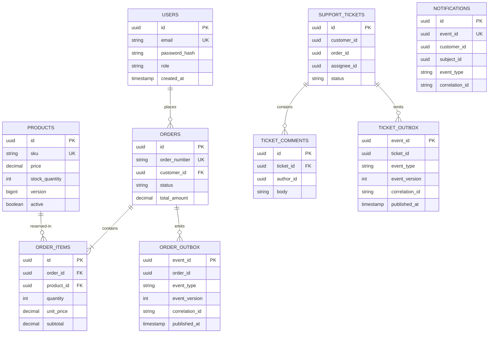

# Data model and ownership

PostgreSQL runs as one local instance. Flyway migrations create `order-service` tables in `public`, ticket tables in `support`, and notifications in `notification`. UUID columns used across services are references by value: a service checks them through an API or event, and no cross-service foreign key or join is used. The early `public.support_tickets` and `public.ticket_comments` tables are legacy scaffolding; a guarded migration removes them only when empty and unreferenced. See [the upgrade guide](legacy-ticket-upgrade.md) for nonempty legacy data.

`SUPPORT_TICKETS.customer_id`, `order_id` and `assignee_id`, `TICKET_COMMENTS.author_id`, and notification IDs are not SQL foreign keys into another service's schema. The order API validates an order reference for a customer; the support API validates staff identity. The notification consumer trusts only validated versioned events and stores one row per `event_id`.

Key indexes include unique email, SKU, order number and notification event ID; customer/status order and ticket indexes; product active/name lookup; and customer/creation-time notification lookup. Order items have a unique `(order_id, product_id)` constraint. Product stock has a nonnegative check and optimistic version column. The SQL source is under each service's `src/main/resources/db/migration/` directory.
